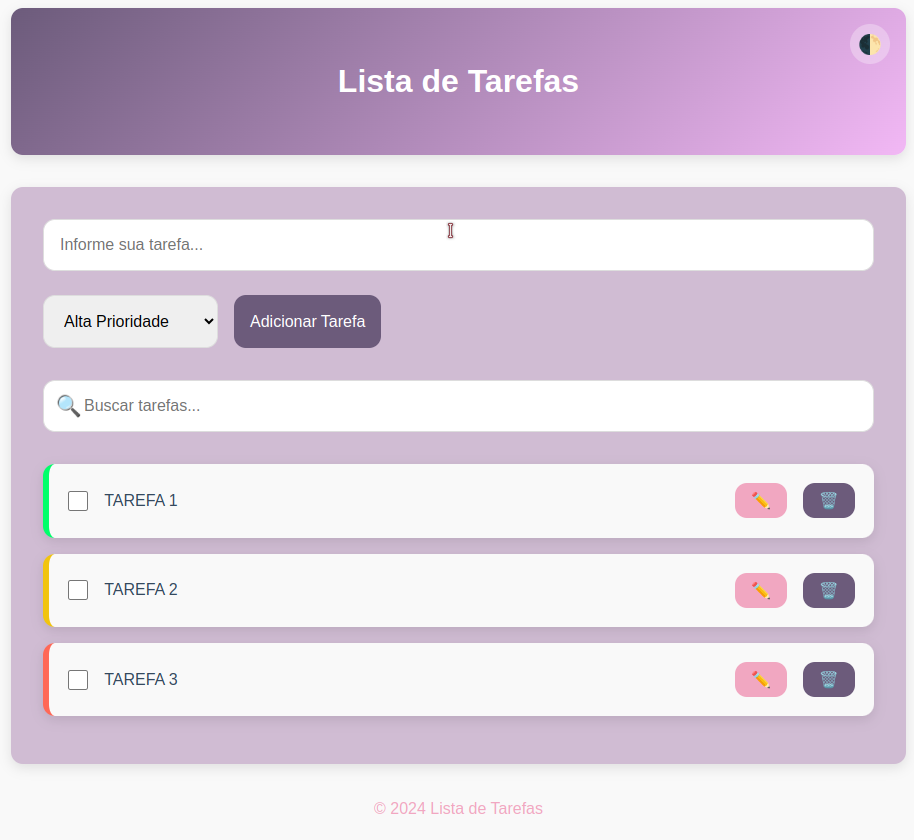

# Lista de Tarefas 📝

Este é um projeto de Lista de Tarefas, desenvolvido com **HTML**, **CSS** e **JavaScript**, que permite organizar tarefas de forma prática e eficiente, com suporte a temas claro/escuro, prioridade de tarefas e persistência de dados via LocalStorage.

---

## 🚀 Funcionalidades

- Adicionar tarefas com diferentes níveis de prioridade (Baixa, Média e Alta).
- Editar tarefas: Altere o título de tarefas existentes com facilidade.
- Concluir tarefas: Marque tarefas como concluídas com um indicador visual intuitivo.
- Buscar tarefas em tempo real: Localize rapidamente tarefas pelo título.
- Excluir tarefas: Remova tarefas indesejadas ou concluídas.
- Temas claro/escuro: Altere o tema conforme sua preferência.
- Persistência de dados: As tarefas são salvas automaticamente no LocalStorage.

---

## 🛠️ Tecnologias Utilizadas

- **HTML5**: Estrutura semântica do projeto.
- **CSS3**: Estilização moderna com transições, animações e design responsivo.
- **JavaScript**: Manipulação do DOM e gerenciamento de estado com LocalStorage.

---

## 🌐 Deploy

Acesse o projeto clicando no link abaixo:  
[To-Do List](https://gabrielabade.github.io/to-do-list/)  

---

## 📸 Prévia do Projeto  

  
